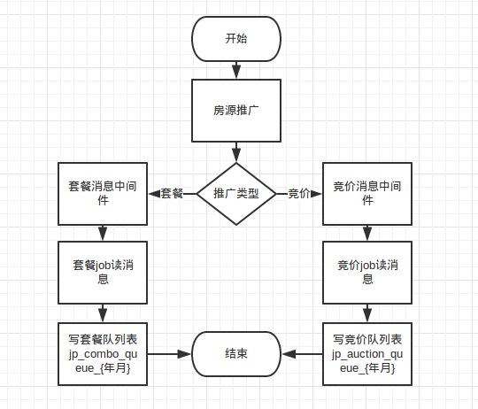

# 上下架通知方式
- 走amqp消息中间件
- 套餐接口
 - 测试环境：http://nydus.dev.anjuke.com/publish?tunnel=sp_prop_package_updown
 - 线上环境：http://nydus.a.ajkdns.com/publish?tunnel=sp_prop_package_updown
- 竞价接口
 - 测试环境：http://nydus.dev.anjuke.com/publish?tunnel=sp_prop_auction_updown
 - 线上环境：http://nydus.a.ajkdns.com/publish?tunnel=sp_prop_auction_updown
- 消息格式

>
    ｛
        "city_id":城市ID(int),
        "broker_id":经纪人ID(int),
        "pro_type":房源类型(int),
        "pro_id":房源ID(int),
        "flag":操作类型(int 1 上架，2 下架)
    ｝

- 用法
 - curl -d '{"city_id":18,"broker_id":580247,"pro_type":1,"pro_id":6020217,"flag":1}' nydus.dev.anjuke.com/publish?tunnel=sp_prop_package_updown
 - 返回数据

>
    {"status":"ok","message":"Success","msgId":"53f1c249ebb203922aca1e79"}

# 流程

备注：现在定价竞价的队列表并没有归档，这些表需要重新设计，并考虑归档。

# 分表
- 数据库：jinpu_db  
- 表名：jp_combo_queue_201408,jp_auction_queue_201408
- 分表说明：按月分表
- 归档：仅保留当月和上一个月的数据
- 表结构：

>

    CREATE TABLE `jp_combo_queue_{年月}` (
        `id`  int(11) UNSIGNED NOT NULL AUTO_INCREMENT COMMENT '日志编号' ,
        `house_id`  int(11) UNSIGNED NOT NULL DEFAULT 0 COMMENT '房源编号' ,
        `status`  tinyint(1) UNSIGNED NOT NULL DEFAULT 1 COMMENT '操作状态 1-更新' ,
        `create_time`  timestamp NOT NULL DEFAULT '0000-00-00 00:00:00' COMMENT '更新时间' ,
        PRIMARY KEY (`id`)
    ) ENGINE=InnoDB DEFAULT CHARSET=utf8 COMMENT='套餐房源队列表'

    CREATE TABLE `jp_auction_queue_{年月}` (
        `id`  int(11) UNSIGNED NOT NULL AUTO_INCREMENT COMMENT '日志编号' ,
        `house_id`  int(11) UNSIGNED NOT NULL DEFAULT 0 COMMENT '房源编号' ,
        `status`  tinyint(1) UNSIGNED NOT NULL DEFAULT 1 COMMENT '操作状态 1-更新' ,
        `create_time`  timestamp NOT NULL DEFAULT '0000-00-00 00:00:00' COMMENT '更新时间' ,
        PRIMARY KEY (`id`)
    ) ENGINE=InnoDB DEFAULT CHARSET=utf8 COMMENT='竞价房源队列表'