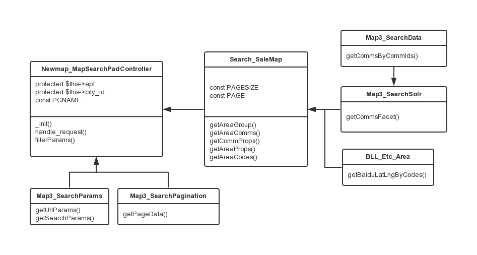

### ipad web二手房地图2.0概要设计

#### 需求描述：

##### 筛选

筛选项固定为“区域/板块”，“价格”，“房型”。

* 区域/板块

  筛选区域时，地图默认缩放等级为`14`；

  筛选板块时，地图默认缩放等级为`16`；

* 非区域板块

  缩放等级与当前实际缩放等级相同；

  地图数据中，聚合/小区房源数量对应筛选条件改变；

  列表页数据，若在地图选中小区，则显示对应筛选项的小区内房源；若未选中小区，则显示可视范围内的房源列表默认rank；

##### 排序

该功能分为默认排序和价格排序，房源套数显示在排序区域；

##### 列表

列表分页房源数：25套/页；

分页滚动至底端时异步请求下一个分页的数据；

##### 房源单页

1. ajax请求单页
 
2. url加码(BI标准)

##### 地图

地图部分通过缩放等级不同展现不同的效果，一共分为 2 大类：<b>区域聚合</b> 与 <b>可视范围内小区</b>;

**缩放等级(zoom)** | **效果**
-- | --
11-13 | 默认为13，显示区域聚合，用户将看到区域名和对应区域的房源数
14-18 | 显示可视区域内的多个(25)小区，选中的小区会显示小区名和房源套数。缩放等级最大(18)时，未选中的小区才会显示小区名，其余情况下只有房源套数
  

##### 数据统计

1. 用户行为

2. js速度监控

3. soj

#### 开发设计：

地图相关的ajax请求，原则上使用统一入口url。针对下期地图的搜索功能，分词设计将提取地图分词功能到类库中，方便今后地图分词功能复用。

##### 区域聚合信息

需要提供的数据列表

**编号** | **数据**
--- | ---
1 | 状态
2 | 聚合
3 | 当前分页
4 | 最大分页数
5 | 房源数
6 | 列表房源
7 | soj数据

##### 可视区域信息

需要提供的数据列表

**编号** | **数据**
--- | ---
1 | 状态
2 | 小区集
3 | 当前分页
4 | 最大分页数
5 | 房源数
6 | 列表房源
7 | soj数据

附类设计图：

#### 可能存在的问题

1. 筛选项 与 搜索/地图/拖动 的不同步 （以中心点为准）
 
2. 响应速度

3. 没有地图加载失败记录

4. 其他http://wiki.corp.anjuke.com/index.php?title=USER-Department-QA-user-product-map-rg

