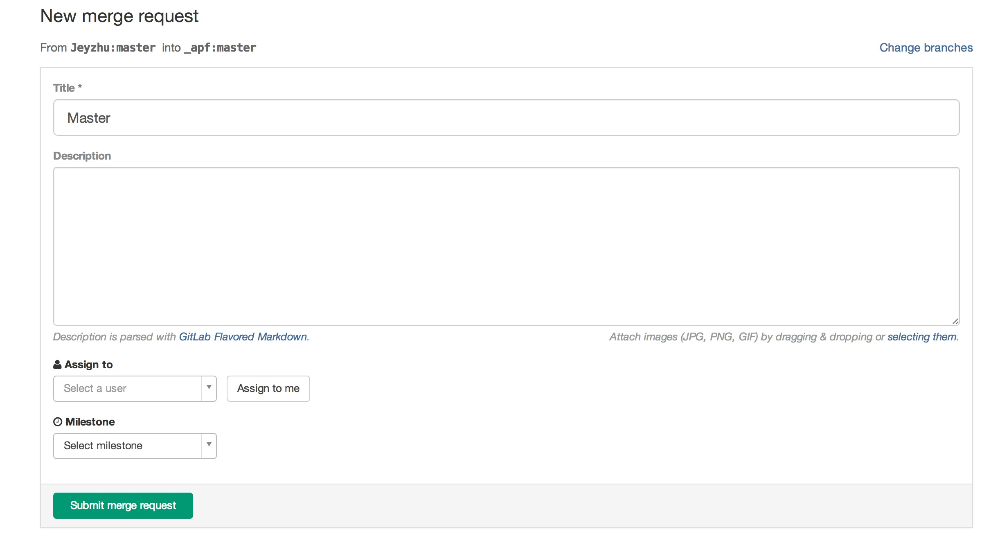

## gitlab pull request 那点事
### 前言 
	本教程只为新手提供 大神请忽略 谢谢！
### why need pull request
	当我们想为框架或开源项目做贡献时 就需要用到 pull request 了

### 如何贡献自己的力量
>
	1.申请帐号 首先你得有gitlab帐号 这个就不介绍了
	2.fork 找到自己想要贡献的项目 并 fork 具体如下图

```
3.clone自己的fork 项目至本地，修改错误并提交 push 至自己fork后的仓库  (以system-ext为例)
git clone git@gitlab.corp.anjuke.com:Jeyzhu/system-ext.git  [clone 自己fork后的仓库]
git add .
git commit -m 'XXX'
git push origin master:master  [提交至自己fork后的仓库]
```
```
4.代码提交了 如何让项目管理者知道自己的请求？ 
```

```
5.点击New merge request 进入如下图的页面
```

```
6.点击Compare branches 进入下图
```

```
7.填完表单 提交  然后 管理者就会收到你的请求通知邮件啦 至此pull request 就完成啦
```

### question 如果原项目有变动该如何更新?
```
1.git remote add init git@gitlab.corp.anjuke.com:_apf/system-ext.git [原项目地址]
2.git pull --rebase init master:master [从原项目仓库拉最新代码]
3.git push origin master [提交至自己fork的仓库]
```

### 管理者在合并 pull request 冲突该如何解决？
```
1.git checkout -b merge-request-test master  [从master创建一个新分支 并切换到新分支]
2.git pull git@gitlab.corp.anjuke.com:Jeyzhu/system-ext.git master [将需要合进来的分支代码拉到该分支]
3.这时应该会有冲突 直接在该分支解决冲突
4.git checkout master
5.git merge --no-ff merge-request-test [把分支合进来]
6.git push origin master
```


